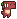
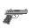
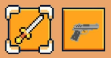
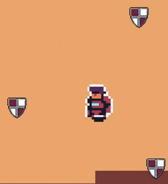

# **The Foreign Survivor**

This game was developped for a course at the faculty of engineering of the university of Porto. It is a 2D top view game where you have to survive as long as possible to waves of enemies. 

You can move around and kill enemies. You have two weapons: a sword and a gun.

## Story

A human land with a Rocket on a extra-terrestrial planet. As soon as he lands, he is attacked by a group of dinosaurs. He tries to survive as long as possible, and become the foreign survivor.

## How to play:

- Movement : WASD
- Attack : Arrow keys ←↑↓→
- pick up item : E
- Switch weapon : Space
- Pause : Escape

## Type of enemies:

- Yellow dinosaur  : attack the player by touching him
- Red dinosaur  : attack the player by shooting him

When you are hit by an enemy, you lose life points, and you have invincibility frames.

## Weapons:

To pick up a weapon, you have to go on it and press E.

- A Sword : 
- A Gun : 

The direction of the attack is the direction of the arrow keys.

## Exprerience:

When you kill an enemy, you gain experience. When you have enough experience, you unlock a Power UP.

- 500 points : unlock a second inventory slot.

  
- 1000 points : unlock shield that turn arround the player and protect him from enemies or projectiles.
  
  

# Upgrade

Since the presentation given to the teachers, we add some features:
- Annoucement of power ups
- Pause menu
- Heart collectible giving life points looted from enemies (1% chance of drop, 1 heart = 20 life point)
- Show the number of enemies still alive

# Non developed features:

As we never developed games before, every feature take a lot of time to develop. As the teacher advised us, we decided to focus on the core of the game, and to have a working game.

## Objectives:

We think that a good survivor game commes with a lot of different enemies, and a lot of different weapons.

We wanted to add a weapon catalog, giving the objective to the player to find all the weapons.

Kill a minimum of enemies with each weapon will unlocked a descritpion of it, like the damage and durability or other effect.